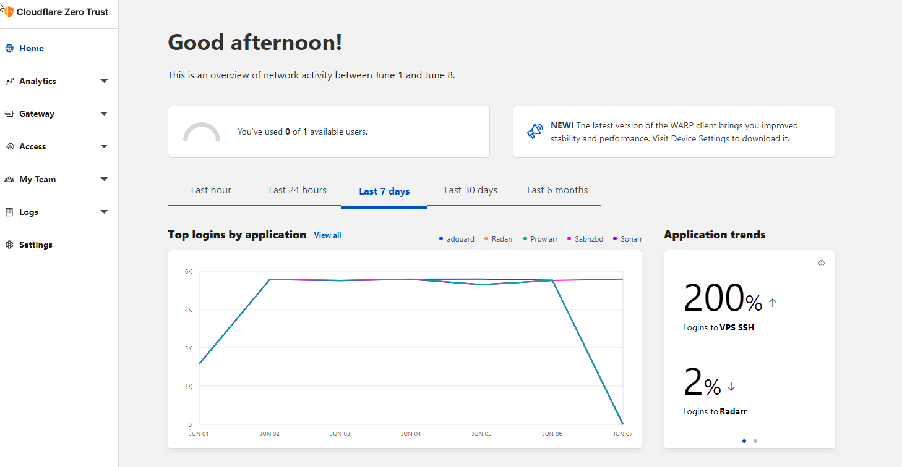
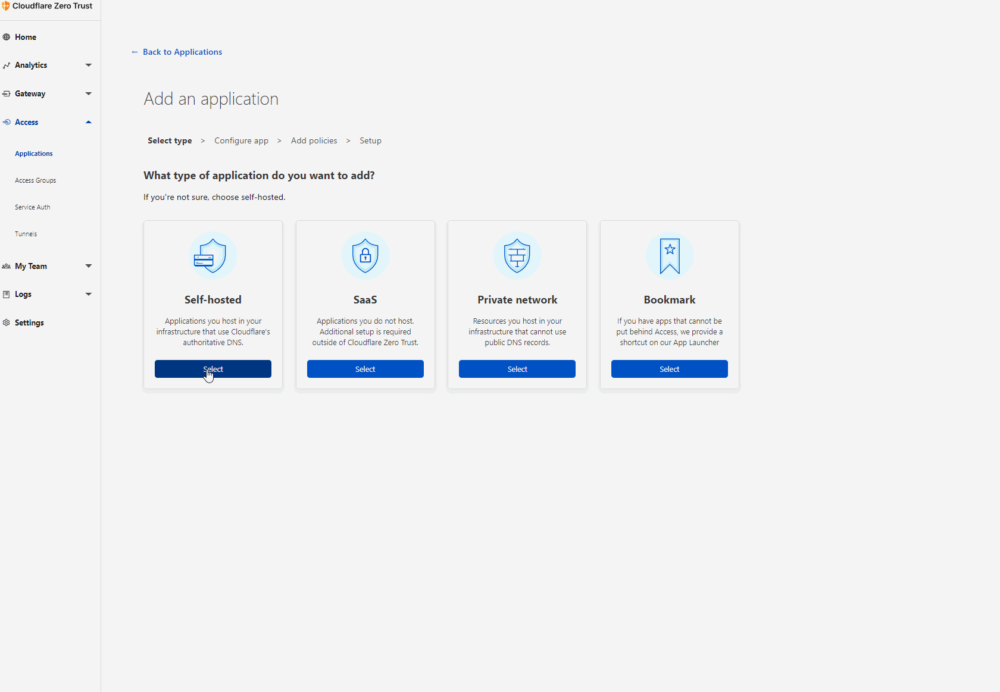

****
Cloudflare Tunnel requires the installation of a lightweight server-side daemon, cloudflared, to connect your infrastructure to Cloudflare. 

`cloudflared` is an [open source project](https://github.com/cloudflare/cloudflared) maintained by Cloudflare.

Releases can be found on [GitHub](https://github.com/cloudflare/cloudflared/releases). Downloads are available as standalone binaries or packages like Debian and RPM.

Detailed release notes can be found on the GitHub [RELEASE_NOTES](https://github.com/cloudflare/cloudflared/blob/master/RELEASE_NOTES) file.

##:fontawesome-brands-cloudflare: Install Cloudfalred with Zero Trust (Option 1)
****
This option will assume you have already setup your domain in Cloudflare and enabled the Zero Trust (formerly Cloudflare Access) panel this will require you to setup at least one method of 2fa, the default is a OTP which is done via email, in my case I have setup Okta as my MFA. 

In the demo, we will imagine we have a service to run like Sonarr which runs on my :fontawesome-brands-ubuntu: Ubuntu host in docker and exposes port 8989 over HTTP. This is what I will show when setting up the tunnel and application in the below.
!!! danger "READ BEFORE PROCEEDING"
    `REMOVE ALL CNAME AND A RECORDS FROM THE CLOUDFLARE DNS PANEL BEFORE CONTINUING`

### Login to the Cloud Flare Zero Trust Panel 
The panel can can be found [here](https://dash.cloudflare.com)

Once you are logged in you should be greeted with a page that looks like this.
<figure markdown>
  { width=800 }
</figure>
From this page you will need to select `Access` in the left hand menu then `Tunnels` from the sub section. You should then see the button in the top right hand corner which is labeled `Create Tunnel`.
<figure markdown>
  { width=800 }
</figure>
Now press the button and follow the process in the below until you are at the point when it asks you to install the `Tunnel Connector`. Simply name the tunnel and select your source machine os.
<figure markdown>
  { width=1000 }
</figure>
Once you have the screen output of the two code snippets, you will select the one on the left to install, and configure the service, or if you have the `cloudflared.service` already installed then you will use the snippet on the right.
These are bash commands that you run in turn on the same host as your service in this case the same host as our "Sonarr" service.
When this is installed and configured you can proceed by scrolling down and pressing the next button, then entering the Public Hosname information, finally move back to the overview tab and press the save button.
<figure markdown>
  { width=1000 }
</figure>

With that being done, you should now have access to your application securely over HTTPS on the subdomain you assinged in this case at `https://sonarr.j-harrison.co.uk`. This will be fine for most applications that you do not want to protect with 2FA, for services like self hosted Plex / Jellyfin instances. However you will have some some other services which you dont want the general public to be able to browse to. This is where the `Cloudflare Zero Trust Applications` come in very handy.
<figure markdown>
  { width=1000 }
</figure>
This one looks complicated but is very simple. Name the application, then set the `Subdomain` and `Domain` to be exactly the same as your `Public Hostname` setup that we previously configured. Following that you can optionally add a custom logo if you wish but it isn't of much use unless you plan to use the CF dashboard. Name your Policy and assign the group that you created when you signed up, in my case I have it to only allow access from my email address, finally and optionally set the Additional settings (checkboxes) and save!.

Now the application is protected and you will be prevented from accessing the site without authenticating with cloudflare first!

!!! tip
    You can add multiple servers to the tunnel, just add more `Public Hostnames` in tunnel configuration, then optionally protect them in the `Applications` section.

##:fontawesome-brands-cloudflare: Install Cloudflared Manually (Option 2)
****
!!! danger "READ BEFORE PROCEEDING"
    `REMOVE ALL CNAME AND A RECORDS FROM THE CLOUDFLARE DNS PANEL BEFORE CONTINUING`

### Installation of Cloudflared

Log into the machine you wish to add a tunnel to in this example I will be using an Ubuntu Server machine.

=== ":material-bash: bash"
``` bash
# INSTALL CLOUDFLARED
mkdir ~/.cloudflared

cd ~/.cloudflared

wget -q https://bin.equinox.io/c/VdrWdbjqyF/cloudflared-stable-linux-amd64.deb

sudo dpkg -i cloudflared-stable-linux-amd64.deb
```

### Create The Argo Tunnel
=== ":material-bash: bash"
``` bash
#This will create a tunnel json file in ~/.cloudflared named [tunnel-id].json
cloudflared tunnel create tunnelnamehere 
```

### Configuration of Cloudflared
=== ":material-bash: bash"
``` bash
cloudflared tunnel login
```

This will present you with a link to follow, so open this link in a browser, this doesnt have to be on the same machine this can be done on another device., once complete this will place a `cert.pem` into `~/.cloudflared`

### Create The Config File For The Argo Tunnel
=== ":material-bash: bash"
``` bash
sudo nano ~/.cloudflared/config.yml
```
Place the following inside the newly created file. In this example I am pointing to a reverse proxy that runs on port 443, however you can update the cname and port to be anything you run on the server.

=== ":octicons-file-code-16: ~/.cloudflared/config.yml"
```yml
tunnel: [TUNNEL-ID TAKEN FROM THE JSON file IT CREATED]
credentials-file: /home/USER/.cloudflared/[TUNNEL-ID].json

config: /home/USER/.cloudflared/config.yml
# NOTE: You should only have one ingress tag, so if you uncomment one block comment the others

# forward all traffic to Reverse Proxy w/ SSL
ingress:
  - hostname: plex.yourdomain.co.uk
    service: https://0.0.0.0:4444
    originRequest:
      connectTimeout: 10s
      noTLSVerify: true
  - hostname: docs.yourdomain.co.uk
    service: https://0.0.0.0:4444
    originRequest:
      connectTimeout: 10s
      noTLSVerify: true
  - hostname: code.yourdomain.co.uk
    service: https://0.0.0.0:4444
    originRequest:
      connectTimeout: 10s
      noTLSVerify: true
  - hostname: ssh.yourdomain.co.uk
    service: ssh://0.0.0.0:22
    originRequest:
      connectTimeout: 10s
      noTLSVerify: true	  
  - hostname: yourdomain.co.uk
    service: https://0.0.0.0:4444
    originRequest:
      connectTimeout: 10s
      noTLSVerify: true
  - service: http_status:404

```

### Add Routing To Your Tunnel In Cloudflare
The following commands will add CNAME records pointing to your tunnel locations in the Cloudflare DNS Panel.
=== ":material-bash: bash"
```bash
cloudflared tunnel route dns tunnelnamehere  hyperionlabs.co.uk

cloudflared tunnel route dns tunnelnamehere  plex.hyperionlabs.co.uk

cloudflared tunnel route dns tunnelnamehere  docs.hyperionlabs.co.uk

cloudflared tunnel route dns tunnelnamehere  code.hyperionlabs.co.uk

cloudflared tunnel route dns tunnelnamehere  ssh.hyperionlabs.co.uk

cloudflared tunnel route dns tunnelnamehere  www.hyperionlabs.co.uk
```

### Setup The Cloudflared Service
=== ":material-bash: bash"
```bash
sudo cp ~/.cloudflared/config.yml /etc/cloudflared/config.yml

sudo cloudflared service install

sudo systemctl enable cloudflared

sudo systemctl start cloudflared

sudo systemctl status cloudflared

sudo systemctl start cloudflared-update.timer

sudo systemctl enable cloudflared-update.timer

sudo systemctl status cloudflared-update.timer
```
!!! success
    This is now complete, but if you ever want to add services be sure to update the `config.yml` in `/etc/cloudflared/` and make the tunnel routes for your new services.
